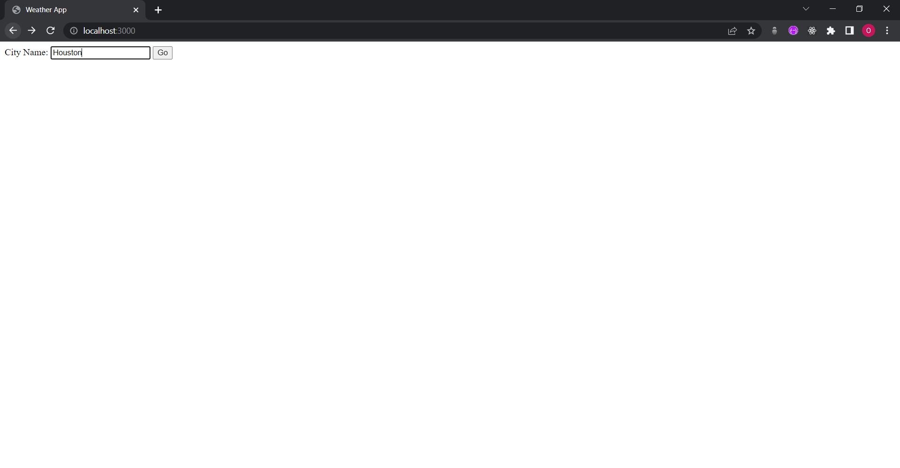

# Angela_Web_Development_Bootcamp
Link to the course is here: https://www.udemy.com/course/the-complete-web-development-bootcamp/

1. CSS - My Site
2. Bootstrap
3. Dicee
4. Drum Kit
5. Simon Game
6. WeatherProject

7. Newsletter-Signup

8. todolist-v1

9. todolist-v2

10. Blog-with-Database

11. Wiki-API

12. Secrets

13. mapping-components-practice-forked

14. usestate-hook-forked

15. usestate-hook-practice-forked

16. es6-spread-operator-forked

17. managing-a-component-tree-practice-forked

18. using-pre-built-react-components-forked

